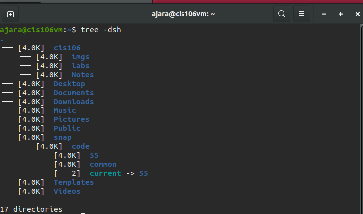

Arnaldo Jara
# Lab 3 | Installing software and navigating the file system | Answers
Assignment description [here](https://raw.githubusercontent.com/ra559/cis106/main/labs/lab3.md)

## Question 1
1. Which command did you use to search for the themes and to install them?
   
   (apt search 'gtk theme')
   (sudo apt install murrine-themes)

2. Which commands did you use to find and install the web browser?
   
   (apt search 'web browser')
   (sudo apt install falkon)

3.1 What is the name of the package?

    (Falkon 3.1.0)

3.2 What dependencies are needed in order to install the package? (you can either take a screenshot of the terminal or copy and paste from the terminal)

3.3 How much disk space will the package utilize after installation?

    (302 MB of additional disk space will be used.)
 

## Question 2

## Question 3

## Question 4

## Question 5

