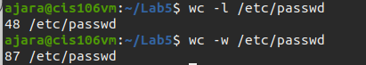

Arnaldo Jara
# Lab 5 | Handling Text Files 

## Question 1 

1. Display the content of the `/etc/passwd` file.
2. Display the content of the `/etc/passwd` file in reverse order.
3. Display the content of the `/etc/passwd` file with line numbers and the $ to indicate the end of every line.
4. Display the first 5 lines of a the `/etc/passwd` file.
5. Display the last 5 lines of the `/etc/passwd` file.

>
 
 
 

## Question 2

1. Display the first field of the `/etc/passwd` file.
2. Display the last 5 users in the `/etc/passwd` file.
3. Display a list of all the users and their designated login shell separated by an `=` sign.
4. The sort command is another amazing tool in any linux user’s tool box. Sort allows you to display data in a given order. Cut the first and 3rd field of the `/etc/passwd` field and sort the output. 
5. Repeat the previous command but this time only show the last 5 entries.

>
 
 
 
 

## Question 3

1. How many lines does the `/etc/passwd` file have?
2. How many words does the `/etc/passwd` file have?
3. How many users can login with the `/bin/bash` shell?
4. How many users have the `/sbin/nologin` shell assigned?
5. Display your user’s information in `/etc/passwd` file

>
 
 
 

## Question 4
1. Run the `ip ad` command and display all the lines that match the string `inet`. How many lines did you get? 
2. Run the `ip ad` command and display all the lines that match the string `inet6`. Display the output in reverse order.
3. Run the `ip ad` command and display all the lines that match the string `inet` or `inet6` sort the output and save it to a file.
4. Run the `ip ad` command and display only the 3rd line that matches the string `inet`.
5. Run the `ip ad` command and display all the ipv4 addresses sorted.

>
 
 
 
 

## Question 5

1. Run the following command and save the output to a markdown file: `echo "# Information about my pc"`. You can use any naming convention you want for the file as long as it is a markdown file.
3. Run the following command and append the output to the markdown file you created earlier: `echo "## CPU Information"`
2. The `lscpu` command displays a lot of information about the CPU the computer has. Use the `lscpu`, `grep`, and the pipe (|) to extract, and append to the file you created earlier, the following information from the output of the `lscpu` command:
   * Architecture
   * Threads
   * Cores
   * Model name
   * CPU Frequency
   * Virtualiation technology supported
3. Run the following command and append the output to the markdown file you created earlier: `echo "## RAM Information"`
4. The command `lshw -c memory` displays information about the RAM installed in your system. Extract and append to the file the following information:
    * Memory size:
5. Display the content of the file you created earlier showing all the data that has been appended so far.

>
 
 
 
 
 
 
