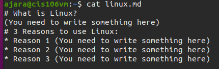
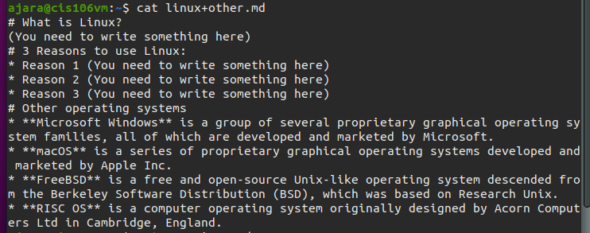
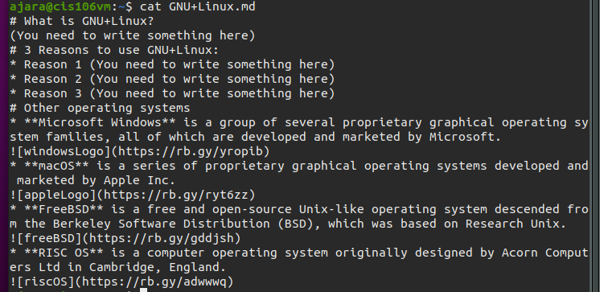

Arnaldo Jara
CIS-106-RE1
# Lab 6 | Using VIM
## Question 2

https://github.com/JuliusNovachrono/cis106/blob/main/vimFolder/linux.md

https://github.com/JuliusNovachrono/cis106/blob/main/vimFolder/linux%2Bother.md

https://github.com/JuliusNovachrono/cis106/blob/main/vimFolder/GNU%2BLinux.md
